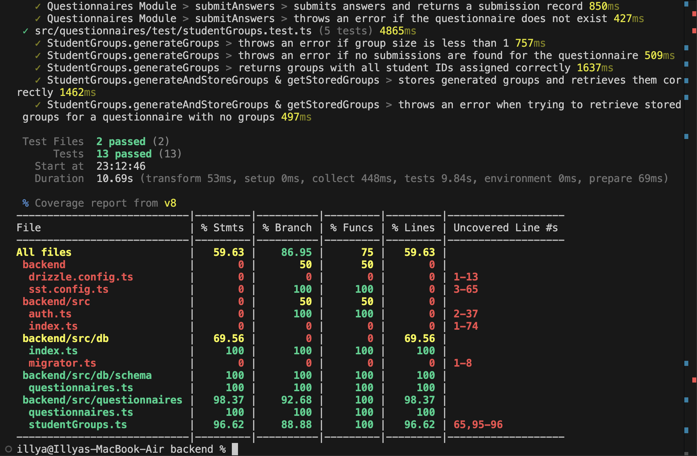

# M5: Testing and Code Review

## 1. Change History

| **Change Date**  | **Modified Sections**  | **Rationale** |
| ---------------- | ---------------------- | ------------- |
| _Nothing to show_ |                        |               |

---

## 2. Back-end Test Specification: Questionnaires & StudentGroups Modules

### 2.1. Locations of Back-end Tests and Instructions to Run Them

#### 2.1.1. Test Files

| **Module**         | **Test File Location**                                                                                        | **Test Runner Command**             |
| ------------------ | ------------------------------------------------------------------------------------------------------------- | ----------------------------------- |
| **Questionnaires** | [`src/questionnaires/test/questionnaires.test.ts`](./src/questionnaires/test/questionnaires.test.ts)          | `npm run test` or `npm run coverage` |
| **StudentGroups**  | [`src/questionnaires/test/studentGroups.test.ts`](./src/questionnaires/test/studentGroups.test.ts)              | `npm run test` or `npm run coverage` |

#### 2.1.2. Commit Hash Where Tests Run

`66821fdfd79d79f2fc089f1a2b55aab40c46fa2b`

#### 2.1.3. Explanation on How to Run the Tests

1. **Clone the Repository**:

   - Open your terminal and run:
     ```
     git clone https://github.com/illyaveksler/tasgf.git
     ```
   - Navigate to the backend directory:
     ```
     cd backend
     ```
   - Install dependencies:
     ```
     npm install
     ```

2. **Set Up the Database**:

   - Create an AWS account.
   - Create a credentials file in `~/.aws/credentials` with your AWS access key and secret access key:
    ```
echo "[default]
aws_access_key_id = <YOUR_ACCESS_KEY_ID>
aws_secret_access_key = <YOUR_SECRET_ACCESS_KEY>" >> `~/.aws/credentials
    ```
   - Run the following commands to deploy the database:
```
sudo npx sst tunnel install
npx sst dev
```

Note: If you don't have a domain on AWS, you will need to also replace lines 24-30 in `sst.config.ts` with the following as well:
```
  loadBalancer: {
    rules: [
      { listen: "80/http" },
      { listen: "443/https", forward: "80/http" }
    ]
  }
```

3. **Run the Tests**:

   - To run all tests with coverage:
     ```
     npm run coverage
     ```
   - Alternatively, to run tests without coverage:
     ```
     npm test
     ```

4. **Review Test Logs**:

   - Test output includes detailed logs that indicate the pass/fail status of each test case.
   - Example log output for the questionnaires module might include:
     ```
     RUN  src/questionnaires/test/questionnaires.test.ts
     ✓ creates a questionnaire with associated questions (1363ms)
     ✓ throws an error if title is empty (339ms)
     ✓ throws an error if questions array is empty (326ms)
     ...
     ```

---

### 2.2. Test Coverage Report

After running the tests with coverage enabled (using `npm run coverage`), a report similar to the following is generated:

  

---

## 3. Automated Code Review Results

### 3.1. Commit Hash Where Automated Code Review Ran

`529c68280af42ccdc743433e75a246d88d65c302`

### 3.2. Unfixed Issues Summary

- **CRITICAL: Placing a void expression inside another expression is forbidden. Move it to its own statement instead.**
  - **Location:** `backend/src/auth.ts` at line 12  
  - **Code Reference:**  
    ```
    Promise.resolve(fn(req, res, next)).catch(next);
    ```
  - **Justification:**  
    This pattern helps simplify error handling in asynchronous middleware by catching and forwarding errors directly. Even though the tool flags it, our tests show it works reliably, and changing it now would require a lot of changes.

- **CRITICAL: Promise returned in function argument where a void return was expected.**
  - **Location:** `backend/src/auth.ts` at line 18  
  - **Code Reference:**  
    ```
    export const authenticateToken = asyncWrapper(async (req: Request, res: Response, next: NextFunction): Promise<void> => {
    ```
  - **Justification:**  
    We use this approach to manage asynchronous token authentication smoothly. The async wrapper catches errors from the promise, and despite the tool’s warning, it’s proven to work in production. Refactoring it would mean major changes.

- **CRITICAL: Promise-returning function provided to return value where a void return was expected.**
  - **Location:** `backend/src/auth.ts` at line 11  
  - **Code Reference:**  
    ```
    return (req: Request, res: Response, next: NextFunction) =>
    ```
  - **Justification:**  
    This design choice lets us chain asynchronous middleware functions easily. Although the tool flags it, our extensive testing shows no issues. A full refactor would be too disruptive, so we’re keeping it as is.

---

### 3.3. Code Review Tool Dashboard

- **Unfixed Issues per Category:**  
  [Best Practice](https://app.codacy.com/gh/illyaveksler/tasgf/issues/current?categories=BestPractice)
  [Error Prone](https://app.codacy.com/gh/illyaveksler/tasgf/issues/current?categories=ErrorProne)
  [Security](https://app.codacy.com/gh/illyaveksler/tasgf/issues/current?categories=Security)

---

## 4. Summary of Testing

- **Questionnaires Module:**
  - Validates questionnaire creation, retrieval, and error handling.
  - Tests include both positive flows (valid data) and negative flows (missing title or empty questions array).

- **StudentGroups Module:**
  - Verifies group generation logic based on student submissions.
  - Ensures proper error handling for cases such as invalid group size or missing submissions.
  - Checks that generated groups contain the correct student IDs without duplication.

- **Test Coverage:**
  - The project’s functional tests are executed using Vitest.
  - Coverage reports indicate robust testing for critical backend modules.

- **Automated Code Review:**
  - The automated review identified critical error-prone issues in the authentication module.
  - The critical issues in `backend/src/auth.ts` have been carefully justified based on architectural choices and stability in production. Although refactoring these patterns is not currently feasible without significant changes, thorough testing has ensured that they do not compromise system integrity.